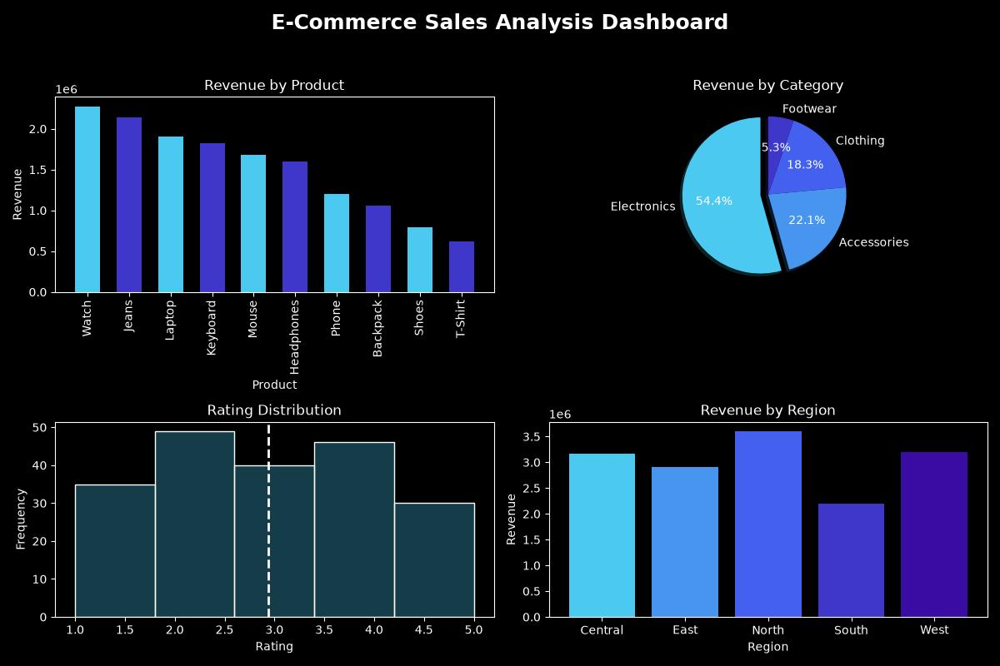

# E-Commerce Sales Analysis Project

## Objective

To analyze e-commerce sales data using NumPy, Pandas and Matplotlib.

---

## Dataset Columns

- order_id
- date
- product
- category
- price
- quantity
- revenue
- region
- rating

---

## Phase 1: Data Inspection

Performed:

- head()
- tail()
- describe()
- info()

Checked:

- Data types
- Number of rows and columns
- Dataset overview

---

## Phase 2: Data Cleaning

Performed:

- Missing value check
- Duplicate value check
- Date conversion

Created new columns:

- discount
- final_price

---

## Phase 3: Business Analysis

Findings:

- Total Revenue = ₹15,090,073
- Average Rating = 2.94
- Highest Revenue Product = Watch
- Best Category = Electronics
- Best Region = North
- Most Sold Product = Jeans
- Highest Rated Product = Keyboard

---

## Phase 4: Visualization

Created:

- Revenue by Product (Bar Chart)
- Revenue by Category (Pie Chart)
- Rating Distribution (Histogram)
- Revenue by Region (Bar Chart)

---

## Tools Used

- Python
- NumPy
- Pandas
- Matplotlib
- Jupyter Notebook

---

## Dashboard Preview

---

## Author

Vivek Sourav